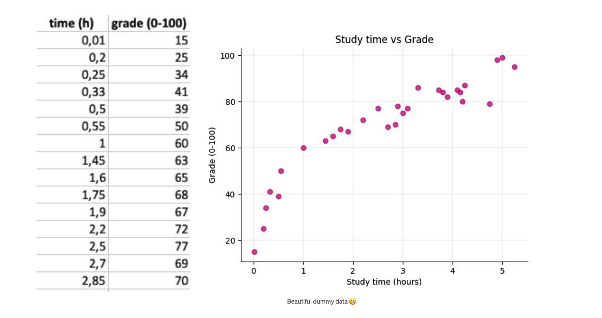

class: inverse, center, middle

# Setup
```{r, echo = FALSE, message=FALSE}
if (!require("pacman")) install.packages("pacman")
pacman::p_load(tidyverse, tidymodels)
```
---

# Introduction
What is a Maximum Likelihood Estimation?

- Maximum likelihood estimation (MLE) is a method of estimating the parameters of an assumed probability distribution, given some observed data.

- If the likelihood function is differentiable, the derivative test for determining maxima can be applied.

- The ordinary least squares estimator maximizes the likelihood of the linear regression model.


---
# Introduction



---
class: inverse, center, middle

# Linear Model (SLR)

---

# SLR

This is the model that best describes the problem at hand


In this equation,

- Grade is an independent variable
- Predictor is the study time.
- The parameters, beta0 and beta1 are the coefficients

---

# SLR

Fit a linear model to the dataset on any statistical software.


---

# SLR


Least Squares method was used to fit the model.

---

class: inverse, center, middle

# Parameter Estimation

---
# Parameter Estimation

## Recall Likelihood Function

Given output $y$, the likelihood function of the parameter $\theta$ is defined as,

$$L(\theta; y) = P(Y=y|\theta)$$

--

## Simple Linear Regression

For SLR model,

$$y = \beta_0+\beta_1x+\sigma$$
--

Four hypotheses are raised,

1. Data points are mutually independent.
2. Dataset follows a normal distribution.
3. The error term $\sigma$ follows a normal distribution whose mean equals to $0$.
4. The output $y$ is continuous.

---

# Parameter Estimation

## Likelihood Function in SLR

Given the two parameters $\beta_0,\beta_1$, input variable $X=x_i$ and error term $\sigma$, the likelihood function is built as,

$$L(\beta_0,\beta_1,\sigma; y)=P(Y=y|X=x_i;\beta_0,\beta_1,\sigma)$$
--

## Conditional Density of $y|x$

In order to find the $\beta_0, \beta_1$, which maximize $L(\beta_0,\beta_1,\sigma;y)$, let's take a look at the density function of $y$.

---

# Parameter Estimation

According to the hypothesis 1, 2 and 4, $y$ should be continuously and normally distributed.

Therefore,

$$f(y)=\frac{1}{\sqrt{2\pi}\sigma}e^{-\frac{(y-\mu_y)^2}{2\sigma^2}}$$

Here $\mu_y=\mu_{\beta_0}+\mu_{\beta_1 x}+\mu_\sigma = \beta_0+\beta_1 \mu_x + \mu_\sigma$

--

According to the hypothesis 3, $\mu_\sigma =0$. Therefore, $\mu_y=\beta_0+\beta_1\mu_x$.

$$f(y|x_i,\beta_0,\beta_1,\sigma)=\frac{1}{\sqrt{2\pi}\sigma}e^{-\frac{(y-(\beta_0+\beta_1x_i))^2}{2\sigma^2}}$$

---

# Parameter Estimation

## Probability of Observations

According to the hypothesis 1, the probability of all observed points are independent. The overall probability equals to the products of every point.

$$\begin{split}\prod^n_{i=1}P(y|X=x_i;\beta_0,\beta_1,\sigma)&=\prod^n_{i=1}\frac{1}{\sqrt{2\pi}\sigma}e^{-\frac{(y_i-(\beta_0+\beta_1x_i))^2}{2\sigma^2}}\\&=\left(\frac{1}{\sqrt{2\pi}\sigma}\right)^ne^{-\frac{\sum^n_{i=1}(y_i-(\beta_0+\beta_1x_i))^2}{2\sigma^2}}\end{split}$$
--

To maximize $\prod^n_{i=1}P(y|X=x_i;\beta_0,\beta_1,\sigma)$ equals to minimize $\sum^n_{i=1}(y_i-(\beta_0+\beta_1x_i))^2$, which is exactly the **sum of square error**.

--

Therefore, the likelihood function can be updated as

$$L(\beta_0, \beta_1, x_i; y)=-\sum^n_{i=1}(y_i-(\beta_0+\beta_1x_i))^2=-SSE$$
---

# Parameter Estimation

## Estimate $\beta_0$

In order to find $\beta_0$ and $\beta_1$, which maximize $L(\beta_0,\beta_1,x_i;y)$, partial derivative methods will be used.

--

$$
\begin{split}
&\frac{\partial L}{\partial \beta_0}=2\sum_{i=1}^{n}(y_i-\beta_0-\beta_1x_i)=0\\
&\downarrow\\
&\hat{\beta_0}=\frac{\sum_{i=1}^{n}y_i-\sum_{i=1}^{n}\beta_1x_i}{n}=\overline{y}-\beta_1\overline{x}
\end{split}
$$

---

# Parameter Estimation

## Estimate $\beta_1$

$$
\begin{split}
&\frac{\partial L}{\partial \beta_1}=2\sum_{i=1}^{n}(y_i-\beta_0-\beta_1x_i)x_i=0\\
&\downarrow\\
&\begin{split}
\sum_{i=1}^{n}(x_iy_i-\beta_0x_i-\beta_1x_i^2)&=\sum_{i=1}^{n}(x_iy_i-(\overline{y}-\beta_1\overline{x})x_i-\beta_1x_i^2)\\
&=\sum_{i=1}^{n}x_iy_i-\overline{y}\sum_{i=1}^{n}x_i+\beta_1(\overline{x}\sum_{i=1}^{n}x_i-\sum_{i=1}^{n}x_i^2)\\&=0
\end{split}\\
&\downarrow\\
&\hat{\beta_1}=\frac{\overline{y}\sum_{i=1}^{n}\frac{x_i}{n}-\sum_{i=1}^{n}\frac{x_iy_i}{n}}{\overline{x}\sum_{i=1}^{n}\frac{x_i}{n}-\sum_{i=1}^{n}\frac{x_i^2}{n}}=\frac{\overline{x}\overline{y}-\overline{xy}}{\overline{x}^2-\overline{x^2}}=\frac{\text{Cov}(x,y)}{\text{Var}(x)}
\end{split}
$$


---

class: inverse, center, middle

# Experiment with Similar Data

---
# Housing Prices (1)

- Let's just jump into a Kaggle data

> data source: https://www.kaggle.com/c/home-data-for-ml-course

- we extract the train.csv and only pay attention to one variable `LotArea` and the response `SalePrice`

---
# Housing Prices (2)

```{r, message=FALSE, fig.height=4.5, dpi=100}
dat <- read_csv("train.csv") %>% select(LotArea, SalePrice)
ggplot(dat, aes(x = LotArea, y = SalePrice)) +
  geom_point(alpha = .2, size = .5, colour = "grey20")
```

---
# Housing Prices (3)

- not so good, try do some transformation(s) (not required though)
- but always do this, cuz the more "normal" our variables are, the "normal" fit the model will be (it's also one of the assumptions of a linear model and you can always use q-q plot to check that).

---
# Housing Prices (4)

```{r, fig.height=4.5, dpi=100}
ggplot(dat, aes(x = log(LotArea), y = log(SalePrice))) +
  geom_point(alpha = .2, size = .5, colour = "grey20")
```

---
# Housing Prices (5)

```{r}
lm_mod <- linear_reg() %>%
  set_engine("lm")
lm_fit <- lm_mod %>%
  fit(log(SalePrice) ~ log(LotArea), data = dat)
lm_fit
```

---
# Housing Prices (6)

```{r}
tidy(lm_fit)
```

$$ \log(\text{SalePrice}) = \beta_0 + \beta_1 \times \log(\text{LotArea}) $$

- so the estimate of intercept $\beta_0$ and the estimate of `LotArea` term $\beta_1$ are `9.21` and `0.309` respectively.

--

- how are we gonna get those two estimates?

--

- the core idea is to take the likelihood of all observations (which is the product of all pdfs of these observations). And remember, the we "assume" the data is normally distributed, that's the reason why we can use normal distribution as the pdf here.

---
# Housing Prices (7)

- then, we take the log of the likelihood. Why? because of calculus. recall that if we want to find the maximizer/minimizer of a product of some polynomials, very computationally expensive. But if we take the log, the product of polynomials will turn to the sum of polynomials.
- eventually, finding the maximizer/minimizer `==` solve for the equation where (first derivative `==` 0).

---
# Housing Prices (8)

```{r}
beta_1_est <- cov(log(dat$LotArea), log(dat$SalePrice)) / var(log(dat$LotArea))
beta_1_est
beta_0_est <- mean(log(dat$SalePrice)) - beta_1_est * mean(log(dat$LotArea))
beta_0_est
```

---
# Housing Prices (9)
Redraw the model in a more stylish manner:
```{r, message = FALSE, echo=FALSE, fig.width=12, dpi=100}
ggplot(dat, aes(x=log(LotArea), y=log(SalePrice))) +
    geom_point(alpha=.2, color = "royalblue") +
    geom_smooth(formula = y~x, color = "red") +
    theme_minimal() +
    labs(
        title = "SalePrice vs LotArea",
        subtitle = "Simple Linear Regression",
        x = "LotArea",
        y = "SalePrice"
    ) +
    theme(
        text = element_text(family = "Roboto Condensed"),
        title = element_text(size = 16),
        plot.subtitle = element_text(size = 14),
        plot.caption = element_text(size = 10),
        axis.title = element_text(size = 14),
        axis.text = element_text(size = 12),
        panel.grid.minor.x = element_blank()
    )
```

---
class: inverse, center, middle

# Homebrew vs Package

---

# Response vs Prediction (1)

```{r, echo=FALSE}
dat <- dat %>%
    mutate(
        `log LotArea` = log(LotArea),
        `log SalePrice` = log(SalePrice),
        `Estimated log(SalePrice)` = beta_0_est+beta_1_est*`log LotArea`)
```

```{r echo=FALSE}
DT::datatable(dat, options = list(pageLength = 7))
```

---

# SLR in Matrix Form

$$
\begin{split}
\begin{bmatrix}Y_1\\Y_2\\\vdots\\Y_n\end{bmatrix}&=\begin{bmatrix}\beta_0+\beta_1X_1\\\beta_0+\beta_1X_2\\\vdots\\\beta_0+\beta_1X_n\end{bmatrix}+\begin{bmatrix}\epsilon_1\\\epsilon_2\\\vdots\\\epsilon_n\end{bmatrix}\\
\begin{bmatrix}Y_1\\Y_2\\\vdots\\Y_n\end{bmatrix}&=\begin{bmatrix}1 & X_1\\1&X_2\\\vdots&\vdots\\1&X_n\end{bmatrix}\begin{bmatrix}\beta_0\\\beta_1\end{bmatrix}+\begin{bmatrix}\epsilon_1\\\epsilon_2\\\vdots\\\epsilon_n\end{bmatrix}\\
\begin{bmatrix}\hat{Y_1}\\\hat{Y_2}\\\vdots\\\hat{Y_n}\end{bmatrix}&=\begin{bmatrix}1 & X_1\\1&X_2\\\vdots&\vdots\\1&X_n\end{bmatrix}\begin{bmatrix}\hat{\beta_0}\\\hat{\beta_1}\end{bmatrix}+\begin{bmatrix}\epsilon_1\\\epsilon_2\\\vdots\\\epsilon_n\end{bmatrix}
\end{split}
$$
---

# Homebrew MLE Estimation

```{r}
homebrew_slr <- function(x, y){
  beta_1_est <- cov(x, y) / var(x)
  beta_0_est <- mean(y) - beta_1_est * mean(x)
  return(c(beta_0_est, beta_1_est))
}
homebrew_slr(dat$`log LotArea`, dat$`log SalePrice`)
```

---

# Response vs Prediction (2)

```{r, echo=FALSE, message=FALSE}
b0 <- homebrew_slr(dat$`log LotArea`, dat$`log SalePrice`)[1]
b1 <- homebrew_slr(dat$`log LotArea`, dat$`log SalePrice`)[2]
dat <- dat %>%
  mutate(`Estimated log(SalePrice) *` = b0+b1*`log LotArea`) %>%
  select(`log LotArea`, `log SalePrice`,
         `Estimated log(SalePrice)`,
         `Estimated log(SalePrice) *`)
```

```{r, echo=FALSE}
DT::datatable(dat, options = list(pageLength = 7))
```

---

class: inverse, center, middle

# Summary

---

# Summary

The model in the article is a Simple Linear Regression (SLR) model, it only considers one variable and one continuous response.

However, an SLR model usually "over-simplifies" the real world. (It might be true for some extreme cases.) You see, a single factor does not lead to a certain result. This world does not operate like this.

For a more complex case, we might want to consider Multiple Linear Regression (MLR) with more than one variables. In some cases, a Generalized Linear Model is considered to fit the data. That is, of course, another topic we should discuss.

---
class: center, middle

# Thanks!

Scripts and slides used in the presentation are available on GitHub: <br /> [**rexarski/case-study-mle**](https://github.com/rexarski/case-study-mle).

Slides created via the R package [**xaringan**](https://github.com/yihui/xaringan).

The chakra comes from [remark.js](https://remarkjs.com), [**knitr**](https://yihui.org/knitr/), and [R Markdown](https://rmarkdown.rstudio.com).
